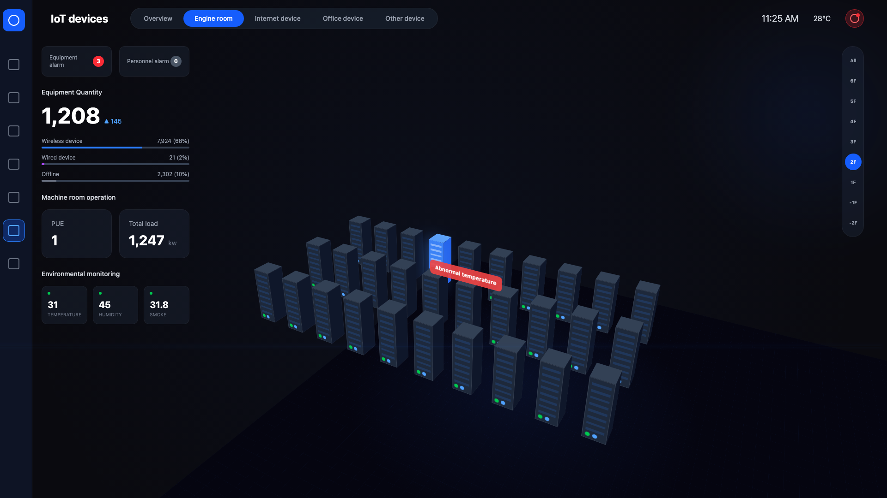

# IoT Device Manager - High-Tier Data Center Visualization

A professional, high-fidelity data center visualization built with **Remotion**, **React**, and **Tailwind CSS**. This project creates a cinematic 3D dashboard experience for monitoring IoT devices in a server room environment, featuring dynamic camera animations, holographic data overlays, and automated alert sequences.



## 🚀 Features

- **Professional Data Center 3D Environment**:
  - Detailed server racks with glass doors, LED indicators, and status bars.
  - Realistic infrastructure: overhead cable trays, cooling vents, and structural wall panels.
  - Enhanced floor decorations: aisle markers, warning strips, and maintenance indicators.
- **Dynamic Cinematic Camera**:
  - Smooth camera movements using Remotion springs.
  - **Automated Alert Sequence**: Detects abnormal devices, zooms in for detailed inspection, and restores position.
- **Holographic Data Overlays**:
  - Real-time status indicators floating above server racks.
  - Interactive HUD (Heads-Up Display) with system metrics and thermal sensors.
- **Sci-Fi Alert System**:
  - Critical overheat detection sequence.
  - Cinematic pop-up display with detailed hardware metrics (CORE_TEMP, FAN_SPEED, etc.).
  - Integrated system logs and emergency shutdown visualizations.
- **Immersive Audio**:
  - Ambient data center background hum.
  - Localized alert sounds for critical events.
- **Frosted Glass UI**:
  - Modern sidebar and panels with backdrop blur and semi-transparent backgrounds.

## 🛠️ Technology Stack

- **[Remotion](https://www.remotion.dev/)**: For programmatic video creation and animation.
- **React**: Component-based UI architecture.
- **Tailwind CSS**: For high-performance utility-first styling.
- **Lucide React / SVG Icons**: For professional iconography.

## 📦 Getting Started

### Prerequisites

- Node.js installed on your machine.
- `npm` or `yarn` package manager.

### Installation

1. Clone the repository.
2. Install dependencies:
   ```bash
   npm install
   ```

### Development

Start the Remotion Studio to preview the dashboard and animations:
```bash
npm run dev
```

### Rendering

To render the final visualization as an MP4 video:
```bash
npx remotion render src/index.ts IoTDashboard out.mp4
```

## 📂 Project Structure

- `src/IoTDashboard.tsx`: Core component containing all 3D environment and UI logic.
- `src/Root.tsx`: Remotion entry point and composition definitions.
- `public/`: Assets including ambient sounds and textures.

---

*Built with ❤️ by the IoT Device Manager Team*
